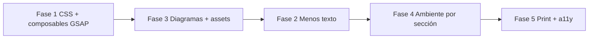

# Plan — UI visual: menos texto, más GSAP y animaciones en bucle

**Proyecto:** web-pf-ts · Logística / Teoría de Sistemas  
**Fecha:** 2026-05-20  
**Relacionado:** [`docs/PLAN.md`](../PLAN.md) (implementación funcional ya completada)

---

## Objetivo

Convertir el sitio de análisis en una **experiencia visual** para sustentación: el contenido académico sigue disponible, pero la lectura principal pasa por **diagramas animados, iconografía, fondos en bucle largo** y **microinteracciones GSAP**, no por párrafos largos y tablas duplicadas.

---

## Diagnóstico (estado actual)

| Área | Estado | Gap |
|------|--------|-----|
| **Vistas** | 7 secciones completas (`PortadaView` … `MockupsView`) | Subtítulos de `PageHeader` muy largos; mucha redundancia texto ↔ diagrama |
| **GSAP** | `lib/gsap.ts`, `useSectionAnimation`, timeline en portada, stagger en `RequirementCategory` | Mismo patrón `fade + y` en todas las vistas; **sin** dibujo SVG, **sin** bucles ambientales; `useScrollReveal` **no usado** en vistas |
| **Tailwind / tw-animate** | `tw-animate-css` importado; `animate-in/out` en shadcn | Casi no hay `@keyframes` propios ni `animation-*` largos (`20s–60s infinite`) |
| **VueUse Motion** | Registrado en `main.ts`; `v-motion` solo en **mockups** | Vistas analíticas sin motion declarativo |
| **Mermaid** | CU con emojis (`👤`, `🚚`); actividad solo texto en nodos | Sin logos UAM/marca, sin iconos Lucide consistentes, **sin** animación post-render |
| **Assets** | `src/assets/jemgdevp.jpeg` únicamente; `public/` vacío | Falta `public/logos/`, sprites de actores, favicon de marca |
| **Texto** | `UseCaseDescriptionCard` muestra 9 campos completos; `CasosUsoView` repite diagrama + tabla + cards + tabla relaciones | Alta densidad; poco “progressive disclosure” |

### Archivos clave hoy

```
src/lib/gsap.ts
src/composables/useSectionAnimation.ts   # entrada genérica
src/composables/useScrollReveal.ts       # sin adopción en views
src/components/content/MermaidDiagram.vue
src/data/useCaseDiagram.ts
src/data/activityDiagrams.ts
src/views/*.vue
src/style.css
```

---

## Principios de diseño

1. **Primero lo visual** — cada sección abre con un elemento animado (diagrama, mapa de actores, métrica) antes del texto.
2. **Texto en capas** — visible: título + 1 línea; detalle en `Accordion`, `Dialog` o panel lateral (“Ver especificación”).
3. **Bucles lentos** — fondos y decoración: `30s–90s`, `ease-in-out`, `infinite`; no compiten con lectura.
4. **GSAP para narrativa** — entrada de sección, trazo de diagrama, highlight de nodo activo; Tailwind para ambiente.
5. **`prefers-reduced-motion`** — desactivar bucles y ScrollTrigger; mantener contenido estático.
6. **Print/PDF intacto** — en `@media print`: sin animación, diagrama en estado final, texto expandido opcional.

---

## Fase 1 — Sistema de animación (fundación)

### 1.1 Utilidades Tailwind en bucle largo (`src/style.css`)

Definir tokens y clases reutilizables (duraciones **largas**):

| Clase | Uso | Duración sugerida |
|-------|-----|-------------------|
| `animate-orbit-slow` | Halo / anillo alrededor de foto portada | 48s |
| `animate-grid-drift` | `bg-grid` con `background-position` | 60s |
| `animate-route-dash` | Líneas de “ruta” decorativas (mockups / portada) | 24s |
| `animate-shimmer-brand` | Borde o barra de acento | 8s |
| `animate-float-soft` | Iconos flotantes en diagramas | 12s |
| `animate-marquee-logos` | Carrusel de logos/actores (footer portada) | 40s |

Ejemplo de patrón en `@theme` / `@layer utilities`:

```css
@keyframes grid-drift {
  0%, 100% { background-position: 0 0; }
  50% { background-position: 24px 24px; }
}
@utility animate-grid-drift {
  animation: grid-drift 60s linear infinite;
}
```

Aplicar en: `PortadaView`, `AppShell` (fondo sutil), `CasosUsoView` / `ActividadView` (contenedor del diagrama).

### 1.2 Composables GSAP (ampliar)

| Archivo | Responsabilidad |
|---------|-----------------|
| `useGsapContext.ts` | `gsap.context()` + cleanup en `onBeforeUnmount` (patrón oficial Vue) |
| `useDiagramDraw.ts` | Tras render Mermaid: `stroke-dashoffset` en paths del SVG, stagger 0.4–1.2s |
| `useDiagramPulse.ts` | Highlight cíclico de nodo/actor (timeline `repeat: -1`, `yoyo`) |
| `useAmbientLoop.ts` | Partículas / puntos en ruta (solo decoración, `pointer-events: none`) |
| Refactor `useSectionAnimation.ts` | Variantes: `hero`, `stagger-cards`, `diagram-only` |

Registrar en vistas: sustituir solo `useSectionAnimation()` por combinaciones según sección.

### 1.3 Adoptar `useScrollReveal`

- `RequerimientosView`, `DescripcionesView`, `ActividadView`: bloques largos con `ref` + reveal al 85% viewport.
- Matar triggers en unmount (ya implementado).

---

## Fase 2 — Menos texto, misma información

### Por vista

| Vista | Quitar / acortar | Sustituir por |
|-------|------------------|---------------|
| **Portada** | Subtítulo largo en párrafo | 3 chips animados (asignatura · carrera · año) |
| **Problema** | 2 párrafos narrativos | 1 frase + 3 columnas solo con icono + bullet corto (máx. 8 palabras) |
| **Requerimientos** | Lista completa visible | Tabs + contador animado; detalle en accordion por ítem |
| **Casos de uso** | Tablas resumen + cards con descripción | **Solo diagrama** + leyenda visual; tablas → `Dialog` “Ver matriz” |
| **Descripciones** | 4 cards con 9 secciones abiertas | Carrusel o tabs por CU; dentro: accordion por campo |
| **Actividad** | Párrafo `descripcion` arriba | Tooltip en icono ℹ️; foco en diagrama con stepper GSAP |
| **Mockups** | Textos de ayuda | Ya tienen `v-motion`; añadir bucles en mapas/status |

### Componentes nuevos

- `ContentTooltip.vue` — icono + detalle (sustituye párrafos explicativos).
- `ExpandableSpec.vue` — “Especificación completa” para CU / requerimientos (print: `open` por CSS).
- Acortar `PageHeader.subtitulo` en `router/index.ts` a **máx. 12 palabras**.

### Datos (`src/data/`)

- Añadir campos opcionales: `resumenCorto`, `icono`, `colorActor` en `actors.ts` / `useCases.ts`.
- Mantener textos largos para PDF; la UI lee la versión corta por defecto.

---

## Fase 3 — Diagramas con usuarios, iconos y logos

### 3.1 Assets (`public/`)

```
public/
  logos/
    uam.svg              # universidad (placeholder hasta asset real)
    marca-logistica.svg  # isotipo del “sistema”
  actors/
    cliente.svg
    repartidor.svg
    supervisor.svg
    administrador.svg
```

En Mermaid con `htmlLabels: true`, nodos actor como:

```mermaid
Cliente["<br/>Cliente"]
```

### 3.2 `MermaidDiagram.vue` — post-proceso

Después de `mermaid.render()`:

1. Inyectar clases en nodos por `data-id` / selector de grupo.
2. Llamar `useDiagramDraw(svgRef)` (GSAP).
3. Opcional: `foreignObject` o overlay Vue con `Icon` Lucide alineado a coordenadas (si Mermaid limita HTML).

### 3.3 `useCaseDiagram.ts`

- Reemplazar emojis por **etiquetas cortas** + clase `actor-node` para estilizar con CSS/SVG.
- Subgrafo sistema: logo centrado arriba (`marca-logistica.svg`).
- Colores por actor alineados a `ActorCard` (`--brand`, variantes).

### 3.4 `activityDiagrams.ts`

- Prefijo icono en actividades clave: `📦` → reemplazar por clase + icono Lucide vía leyenda lateral animada (no dentro de cada nodo si ensucia).
- **Stepper** debajo del diagrama: 5–7 pasos; GSAP resalta el nodo activo en el SVG (`fill` / `filter`).

### 3.5 Alternativa (si Mermaid limita demasiado)

`UseCaseDiagramCanvas.vue` — SVG manual con `reka-ui` + posiciones fijas; solo para CU (1 diagrama). Mayor control de logos y animación; más trabajo. **Reservar** si Fase 3.2 no alcanza calidad.

---

## Fase 4 — Ambiente visual por sección

| Sección | Ambiente (Tailwind bucle) | GSAP (narrativa) |
|---------|---------------------------|------------------|
| Portada | `animate-grid-drift` + `animate-orbit-slow` en halo foto | Timeline actual + partículas ruta |
| Problema | Iconos actores `animate-float-soft` | Stagger cards + hover `scale` |
| Requerimientos | Barra progreso `animate-shimmer-brand` | Contador `gsap.to` números RF/RN |
| Casos de uso | Marco diagrama con borde animado | Draw SVG + pulse en actor al hover sidebar |
| Actividad | Línea “flujo” decorativa | Stepper sincronizado con nodos |
| Mockups | Status dots + mapa (ya pulse) | Timeline entrada tabs |

### Sidebar / shell

- Indicador sección activa: barra lateral `scaleY` animada (GSAP).
- Logo mini en sidebar colapsado (`marca-logistica.svg`).

---

## Fase 5 — Mockups, accesibilidad y export

- Unificar helpers `enterUp` / `enterFromRight` en `src/composables/useMockupMotion.ts` (ya repetidos en 8 archivos).
- Mockups: rutas con `animate-route-dash` en polilíneas decorativas.
- `prefers-reduced-motion: reduce` → clase `.motion-safe` que anula `animation` y mata GSAP timelines.
- `@media print`: expandir accordions, ocultar decoración animada, diagrama estático completo.

---

## Orden de implementación recomendado



| Prioridad | Entregable | Esfuerzo |
|-----------|------------|----------|
| P0 | Keyframes bucle en `style.css` + portada | Bajo |
| P0 | `useDiagramDraw` + animación CU | Medio |
| P1 | Assets `public/logos` + actores en Mermaid | Medio |
| P1 | Acortar headers y quitar tablas duplicadas en `CasosUsoView` | Bajo |
| P2 | Accordion en `DescripcionesView` / `RequerimientosView` | Medio |
| P2 | Stepper actividad + `useScrollReveal` | Medio |
| P3 | SVG canvas alternativo (solo si hace falta) | Alto |

---

## Archivos a crear / modificar

**Crear**

- `docs/plans/animaciones-ui-visual.md` (este archivo)
- `src/composables/useGsapContext.ts`
- `src/composables/useDiagramDraw.ts`
- `src/composables/useDiagramPulse.ts`
- `src/composables/useAmbientLoop.ts`
- `src/composables/useMockupMotion.ts`
- `src/components/content/ContentTooltip.vue`
- `src/components/content/ExpandableSpec.vue`
- `public/logos/*.svg`, `public/actors/*.svg`

**Modificar**

- `src/style.css` — keyframes + utilities bucle
- `src/components/content/MermaidDiagram.vue` — hooks post-render
- `src/data/useCaseDiagram.ts`, `activityDiagrams.ts`
- `src/router/index.ts` — subtítulos cortos
- `src/views/*.vue` — layout visual-first
- `src/components/layout/PageHeader.vue` — subtítulo opcional / tooltip

**No tocar (salvo print)**

- Lógica de datos en `src/data/*` (solo añadir campos cortos)
- CI / Docker / `package.json` (GSAP y Mermaid ya instalados)

---

## Verificación

- [ ] `pnpm dev` — bucles visibles en portada y diagrama CU sin jank
- [ ] `prefers-reduced-motion` — sin bucles ni ScrollTrigger
- [ ] `pnpm type-check` && `pnpm lint`
- [ ] Print preview — texto completo legible, sin sidebar, diagramas completos
- [ ] Lighthouse: animaciones no bloquean LCP (cargar GSAP solo en vistas que animan diagrama)

---

## Métricas de éxito (cualitativas)

- Subtítulos de sección ≤ 12 palabras; párrafos intro ≤ 2 por vista.
- Al menos **4** animaciones Tailwind `infinite` ≥ 20s en el sitio.
- Diagrama CU con **draw-in** GSAP y actores con icono/logo (no solo emoji).
- `CasosUsoView`: una pantalla “hero” = diagrama; tablas bajo demanda.
- Sustentación oral apoyada en mockups + diagramas animados, no lectura de cards largas.

---

## Notas

- El plan de implementación original ([`docs/PLAN.md`](../PLAN.md)) está **completo** en funcionalidad; este documento es una **capa de pulido visual** posterior.
- No añadir dependencias pesadas (p. ej. Lottie) salvo que un asset lo exija; GSAP + Tailwind + SVG bastan.
